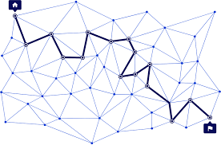
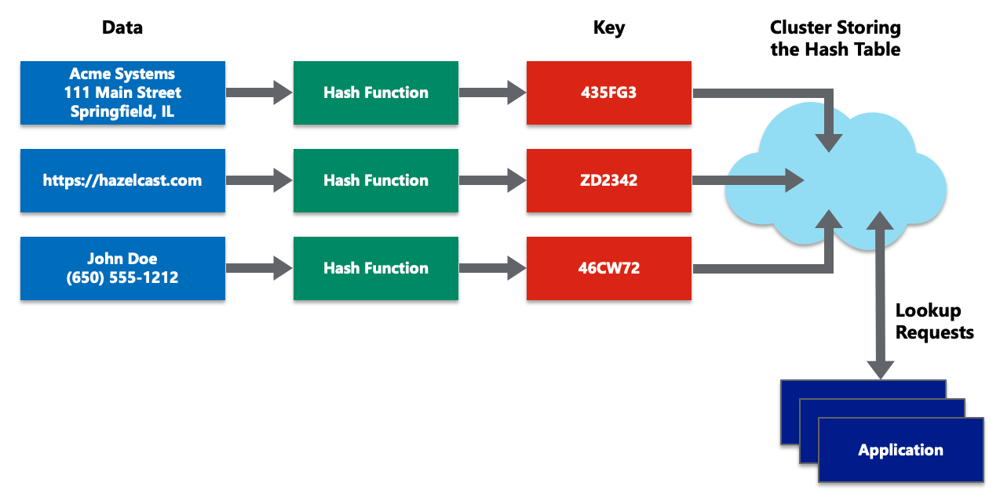

# Proyecto de Red Routing Overlay Descentralizada con gRPC y Kademlia

## Introducción

### Routing Overlay
Un **routing overlay** es una red lógica superpuesta sobre una red física. Los nodos en un routing overlay pueden comunicarse entre sí directamente a través de enlaces virtuales, independientemente de su ubicación física en la red subyacente. Esto permite la creación de redes eficientes y escalables, facilitando la transmisión de datos y la realización de tareas distribuidas.



### DHT Kademlia
Kademlia es una **Distributed Hash Table (DHT)** que permite la localización eficiente de nodos y datos en una red P2P. Utiliza un sistema de enrutamiento basado en XOR y una tabla de enrutamiento estructurada en buckets, lo que facilita la escalabilidad y la tolerancia a fallos. Kademlia es ampliamente utilizada en redes descentralizadas debido a su eficiencia y robustez.



### Comunicación con gRPC y Protocol Buffers

Cada servicio define sus propios métodos y mensajes gRPC utilizando Protocol Buffers. Los archivos `.proto` se encuentran en el subdirectorio `proto` de cada servicio, y el código generado por `protoc` se utiliza para facilitar la comunicación eficiente entre los servicios.

### (boostrap.proto)

```protobuf
syntax = "proto3";

package discovery;

option go_package = "../proto";

service Bootstraper {
    rpc Bootstrap (BootstrapRequest) returns (BootstrapResponse) {}
}
  
message BootstrapRequest {
    bytes id = 1;
    string address = 2;
}

message BootstrapResponse {
    string message = 1;
}

### (discovery.proto)

```protobuf
syntax = "proto3";

package discovery;

option go_package = "../proto";

service Discoverer {
    rpc Discovery (DiscoveryRequest) returns (DiscoveryResponse) {}
}

message Neighbor {
    bytes id = 1;
    string address = 2;
}

message DiscoveryRequest {
    bytes id = 1;
}

message DiscoveryResponse {
    repeated Neighbor neighbor_list = 1;
}

### (retrieve.proto)

```protobuf
syntax = "proto3";

package discovery;

option go_package = "../proto";

service Retriever {
    rpc Retrieve (RetrieveRequest) returns (RetrieveResponse) {}
}

message RetrieveRequest {
    string domain = 1;
    int32 jumps = 2;
}

message RetrieveResponse {
    bytes id = 1;
    string address = 2;
}
